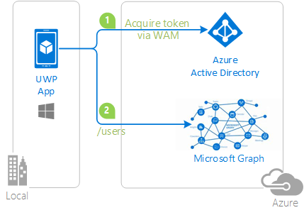

# Universal Windows Platform (UWP) application calling the Microsoft Graph using Windows 10 Web Account Manager


This sample demonstrates a Universal Windows Platform (UWP) app calling the directory Graph API to look up a user. The UWP app uses the Windows 10 [WebAccountManager API](https://docs.microsoft.com/en-us/uwp/api/Windows.Security.Authentication.Web.Provider.WebAccountManager) to obtain an access token for the Graph as the currently signed in user, or any valid Azure AD account entered by the user.

For more information about how the protocols work in this scenario and other scenarios, see [Authentication Scenarios for Azure AD](http://go.microsoft.com/fwlink/?LinkId=394414).



## Steps to run

## How To Run This Sample

To run this sample, you'll need:

- [Visual Studio 2017](https://aka.ms/vsdownload)
- [Windows 10 Tools for Visual Studio](https://developer.microsoft.com/en-us/windows/downloads)
- [Windows 10 (development mode enabled)](https://docs.microsoft.com/en-us/windows/uwp/get-started/enable-your-device-for-development)
- An Internet connection
- An Azure subscription (a free trial is sufficient)
- A Microsoft account

Every Azure subscription has an associated Azure Active Directory tenant.  If you don't already have an Azure subscription, you can get a free subscription by signing up at [http://wwww.windowsazure.com](http://www.windowsazure.com).  All of the Azure AD features used by this sample are available free of charge.

### Step 1:  Clone or download this repository

From your shell or command line:

`git clone https://github.com/AzureADSamples/NativeClient-UWP-WAM.git`

### Step 2:  [OPTIONAL] Register the sample with your Azure Active Directory tenant and update the code accordingly

The sample app can be ran as is with any Azure AD tenant. If you just want to see how the code behaves, you can simply launch the app and play with it.
If you want to restrict the use of the app to your tenant only, or if you want to learn how to register new UWP apps in Azure AD, follow the instructions below.

#### Find the system assigned app's redirect URI

Before you can register the application in the Azure portal, you need to find out the application's redirect URI.  Windows 10 provides each application with a unique URI and ensures that messages sent to that URI are only sent to that application.  To determine the redirect URI for your project:

1. Open the solution in Visual Studio.
2. Open the `MainPage.xaml.cs` file.
3. Find this line of code and set a breakpoint on it.

    ```CSharp
    string URI = string.Format("ms-appx-web://Microsoft.AAD.BrokerPlugIn/{0}", WebAuthenticationBroker.GetCurrentApplicationCallbackUri().Host.ToUpper());
    ```

4. Hit F5.
5. When the breakpoint is hit, use the debugger to determine the value of redirectURI, and copy it aside for the next step.
6. Stop debugging, and clear the breakpoint.

The redirectURI value will look something like this text:

```Text
ms-appx-web://Microsoft.AAD.BrokerPlugIn/S-1-15-2-2650639956-658609593-457089695-429683492-3460685052-1353383220-3160185542
```

#### Register the app

As a first step you'll need to:

1. Sign in to the [Azure portal](https://portal.azure.com).
1. On the top bar, click on your account and under the **Directory** list, choose the Active Directory tenant where you wish to register your application.
1. Click on **All services** in the left-hand nav, and choose **Azure Active Directory**.

#### Register the client app

1. In the  **Azure Active Directory** pane, click on **App registrations** and choose **New application registration**.
1. Enter a friendly name for the application, for example 'NativeClient-UWP-WAM' and select 'Native' as the *Application Type*.
1. For the *Redirect URI*, enter the value that you obtained during the previous step.
1. Click on **Create** to create the application.
1. In the succeeding page, Find the *Application ID* value and copy it to the clipboard. You'll need it to configure the Visual Studio configuration file for this project.
1. Then click on **Settings**, and choose **Properties**.
1. Configure Permissions for your application. To that extent, in the Settings menu, choose the 'Required permissions' section and then:

   - click on **Add**, then **Select an API**, and type `Microsoft Graph` in the textbox. Then, click on  **Select Permissions** and select **Sign in and read user profile** and **Read all users basic profile**.

#### Update the app code to reflect the new registration coordinates

1. Open `MainPage.xaml.cs'.
1. Find the declaration of `clientId` and replace the value with the Client ID from the Azure portal.
1. Find the const declaration named `tenant`, and replace the value with the name of your Azure AD tenant.

### Step 4:  Run the sample

Clean the solution, rebuild the solution, and run it.

The application flow is simple:

- As the app starts, you will either be automatically logged in (if you are signed in on your computer with a valid Azure AD user)
- or you'll be prompted to sign in.
- As soon as you do so, you will be able to type the alias of any user from the directory of your signed in account and get back some simple user attributes.
- If you want to query a different directory, click on the hyperlink button on top of the screen, enter the credentials for the new account, and repeat the process.

The app will remember the account you used the last time you run it, and attempt to sign in as that account at startup time.
You can expect the exact same behavior when running the app on a mobile device or emulator.

## Community help and support

We use [Stack Overflow](http://stackoverflow.com/questions/tagged/WebAccountManager) with the community to provide support. We highly recommend you ask your questions on Stack Overflow first and browse existing issues to see if someone has asked your question before. Make sure that your questions or comments are tagged with [`uwp` `dotnet` `microsoft-graph` `WebAccountManager`].

If you find and bug in the sample, please raise the issue on [GitHub Issues](../../issues).

To provide a recommendation, visit our [User Voice page](https://feedback.azure.com/forums/169401-azure-active-directory).

## Contributing

If you'd like to contribute to this sample, see [CONTRIBUTING.MD](/CONTRIBUTING.md).

This project has adopted the [Microsoft Open Source Code of Conduct](https://opensource.microsoft.com/codeofconduct/). For more information, see the [Code of Conduct FAQ](https://opensource.microsoft.com/codeofconduct/faq/) or contact [opencode@microsoft.com](mailto:opencode@microsoft.com) with any additional questions or comments.

## More information

For more information, please visit the [documentation homepage for Microsoft identity](http://aka.ms/aaddev) or visit one of the following links.

- [Web Account Manager](https://docs.microsoft.com/en-us/windows/uwp/security/web-account-manager)
- [Overview of Microsoft Graph](https://developer.microsoft.com/en-us/graph/docs/concepts/overview)
- [Get access tokens to call Microsoft Graph](https://developer.microsoft.com/en-us/graph/docs/concepts/auth_overview)
- [Use the Microsoft Graph API](https://developer.microsoft.com/en-us/graph/docs/concepts/use_the_api)
